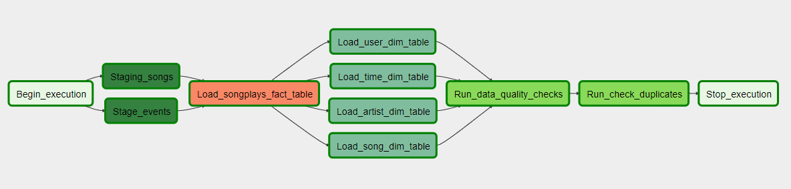

# The Project
The music streaming startup Sparkify, has decided that it is time to introduce more automation and monitoring to their data warehouse ETL pipelines and come to the conclusion that the best tool to achieve this is Apache Airflow.

They want to set an Airflow data pipeline to load the data from an S3 storage bucket to an AWS Redshift data warehouse, ensuring that data quality checks are performed on the data in the warehouse to catch any discrepancies in the datasets.

The steps in the data pipeline are:
- begin
- load data to staging tables
- load data to **songplays** fact table
- load data to dimension tables: **users, songs, artists, time**
- first data quality check: check that all tables are populated
- second quality check: chek if there are duplicates
- stop

The pipeline looks like in the picture below.


## The data
The datasets are stored in a public S3 bucket.

The first dataset is stored in `s3://udacity-dend/song_data` and contains metadata about the songs the users listen to.
For each song there is a json file, data are organized in this way:
```
{"num_songs": 1, "artist_id": "ARJIE2Y1187B994AB7", "artist_latitude": null, "artist_longitude": null, "artist_location": "", "artist_name": "Line Renaud", "song_id": "SOUPIRU12A6D4FA1E1", "title": "Der Kleine Dompfaff", "duration": 152.92036, "year": 0}
```

The second dataset, stored in `s3://udacity-dend/log_data`, stores information related to users' activities. 
In each row there are these information:


## The data warehouse
The structure of the data warehouse (DWH) is in **create_tables.sql**. The current project is just using the DWH as it is.

The DWH uses a **star** schema, with the events stored in the **songplays** table, and the dimensions in **users, songs, artists, time**. 


## The operators
Ad-hoc operators have been created for the DAG. In particular, they reduce programming effort for similar-repetitive tasks, for example loading dimension tables.


### The Stage Operator: StageToRedshiftOperator

The **stage operator** execute a query to load any JSON formatted files from S3 to AWS Redshift.

The SQL COPY query is passed, already formatted, to the operator, that just need to connect to the Redshift database using PostgresHook and execute the query.

### The Load Fact Operator: LoadFactOperator

The **LoadFactOperator** loads the data into the **songplays** fact table. 

The class is derived from the BaseOperator and uses the PostgresHook to connect the Redshift database.

### The Load Dimension Operator: LoadDimensionOperator

The **LoadDimensionOperator** loads the data into the fact tables: **users, artists, songs, time**.

The class is derived from the BaseOperator and use a commn code that can be customized for a specific table.


### Data Quality checks

#### DataQualityOperator
It checks that all tables have been populated during previous tasks: *load fact* and *load dimensions*.

It raises an error if a table has 0 column.

#### CheckDuplicatesOperator
It checks if there are duplicates in the *table* and *columns* specified.

It informs the user if and where are the duplicates. It does not stop the execution.


## The file system

- **./readme.md** contains the important information about the project, in markdown format
- **./dags/etl_dag.py** is the main DAG 
- **./plugins/__init__.py** exposes the helper and the operators to be used in the DAG
- **./plugins/operators/stage_redshift.py**. This operator copies the file from the S3 bucket to staging tables in AWS Redshift  
- **./plugins/operators/load_fact.py** loads the data to the **songplays** fact table
- **./plugins/operators/load_dimension.py** loads the data to the dimension tables: **users, songs, time, artists**
- **./plugins/operators/data_quality.py** checks that all tables are populated
- **./plugins/operators/check_duplicates.py** checks if there are duplicate in table and columns passed as parameters
- **./plugins/operators/__init__.py** exposes the operator classes: **StageToRedshiftOperator, LoadFactOperator, LoadDimensionOperator, DataQualityOperator, CheckDuplicatesOperator**
- **./plugins/helpers/__init__.py** exposes the sqlQueries class 
- **./plugins/sql_create.sql** contains the sql queries used to generate the tables


## Running the project

To run the project a couple of steps are required:
- create the AWS credential variable, either using Airflow UI or via CLI with the command:

`airflow connections -a --conn_id 'aws_credentials' --conn_type 'aws' --conn_login 'aws_access_key_id' --conn_password 'aws_secret_access_key'`

- create the Redshift connnection variable to be used in the PostgresHook, either via UI or CLI:

`airflow connections -a --conn_id 'redshift' --conn_type 'postgres' --conn_host 'redshift-cluster-1.cugnyqpetzqp.us-west-2.redshift.amazonaws.com' --conn_schema 'dev' --conn_login 'aws_user' --conn_password 'aws_user_password' --conn_port 5439`

- start Airflow web server:

`/opt/airflow/start.sh`

- access Airflow web-based user interface and run the **etl_dag**

